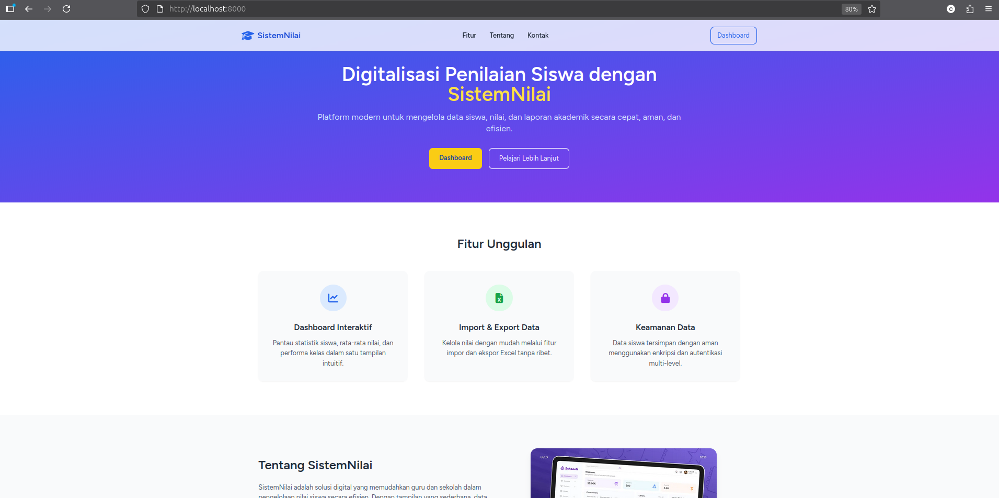

# **Sistem Penilaian Siswa (Laravel \+ React)**

## **About**

Proyek ini adalah aplikasi sederhana untuk mengelola data nilai siswa, dibangun ulang menggunakan stack Laravel, React, dan Inertia.js. Tujuan dari proyek ini adalah untuk melatih dan mendemonstrasikan skill dalam membangun aplikasi monolitik (monolith) menggunakan React sebagai frontend di dalam ekosistem Laravel.

Aplikasi ini mempermudah penilaian terhadap siswa dengan fitur autentikasi, CRUD (Create, Read, Update, Delete), serta fungsionalitas import/export data.

## **Screenshoot**

### **Dashboard**

### **Detail Siswa**

### **Landing Page**

## **Arsitektur**

Proyek ini menggunakan arsitektur monolitik yang terintegrasi:

* **Laravel** sebagai backend.  
* **React 18** sebagai frontend.  
* **Inertia.js** sebagai penghubung antara backend dan frontend.  
* **Tailwind CSS** untuk styling.  
* **Vite** sebagai build tool.

### **Alasan Memilih Arsitektur**

Arsitektur ini dipilih untuk menciptakan pengalaman pengembangan full-stack yang efisien. Dengan Inertia.js, Laravel dapat merender komponen React secara langsung dari backend, menggabungkan keunggulan Server-Side Rendering (SSR) dengan reaktivitas Single Page Application (SPA). Pendekatan ini lebih sederhana daripada membangun API terpisah, karena mengurangi kompleksitas dalam manajemen endpoint, state, dan autentikasi.

Struktur proyek ini juga dirancang untuk mengikuti prinsip **Clean Code**, memastikan kode yang mudah dikelola, diperluas, dan diuji.

## **Prerequisites**

* PHP \>= 8.2  
* Composer  
* Node.js \>= 18.x dan NPM  
* Database (PostgreSQL, MySQL, atau SQLite)  
* Git

## **Installation**

Ikuti langkah-langkah berikut untuk menginstall dan menjalankan proyek. Pastikan semua prerequisites sudah terinstall.

### **1\. Clone Repository**

git clone [https://github.com/ugunNet21/sinilai-lareact.git](https://github.com/ugunNet21/sinilai-lareact.git)
cd sinilai-lareact

### **2\. Setup Database (Contoh: PostgreSQL)**

1. Jalankan server PostgreSQL.  
2. Buat database baru, misalnya db\_sinilai\_react.  
3. Buat user database dengan hak akses yang diperlukan.  
   CREATE DATABASE db\_sinilai\_react;  
   CREATE USER user\_react WITH PASSWORD 'password\_react';  
   GRANT ALL PRIVILEGES ON DATABASE db\_sinilai\_react TO user\_react;

### **3\. Konfigurasi Environment (.env)**

1. Salin file .env.example menjadi .env:  
   cp .env.example .env

2. Sesuaikan file .env dengan konfigurasi database Anda:  
   DB\_CONNECTION=pgsql  
   DB\_HOST=127.0.0.1  
   DB\_PORT=5432  
   DB\_DATABASE=db\_sinilai\_react  
   DB\_USERNAME=user\_react  
   DB\_PASSWORD=password\_react

3. Generate kunci aplikasi:  
   php artisan key:generate

### **4\. Install Dependencies**

1. Install dependensi PHP dengan Composer:  
   composer install

2. Install Jetstream dengan Inertia dan dukungan SSR:  
   php artisan jetstream:install inertia \--ssr

3. Install adapter React untuk Jetstream:  
   npx laravel-jetstream-react@latest install

4. Install dependensi Node.js:  
   npm install

5. Install Spatie Permission
   composer require spatie/laravel-permission
   php artisan vendor:publish --provider="Spatie\Permission\PermissionServiceProvider"

### **5\. Jalankan Migration dan Seeder**

1. Jalankan migrasi untuk membuat tabel-tabel di database:  
   php artisan migrate

2. (Opsional) Untuk menghapus semua tabel, menjalankan migrasi, dan mengisi data awal (seed):  
   php artisan migrate:fresh \--seed

3. Untuk menjalankan seeder saja:  
   php artisan db:seed  
   \# Atau menjalankan seeder spesifik  
   php artisan db:seed \--class=UserSeeder

### **6\. Compile Assets**

Build aset frontend untuk production:

npm run build

## **How to Run the Project**

1. **Jalankan Server Laravel**  
   php artisan serve

   Aplikasi akan berjalan di http://127.0.0.1:8000.  
2. Jalankan Server Development (Vite)  
   Untuk menikmati hot-reloading saat development, jalankan perintah ini di terminal terpisah:  
   npm run dev

3. Akses Aplikasi  
   Buka browser dan kunjungi http://127.0.0.1:8000. Halaman login akan muncul.

### **Contoh Akun User (dari Seeder)**

* **Email**: admin@contoh.com  
* **Password**: password

Anda juga bisa mendaftarkan akun baru melalui halaman registrasi.

## **Lainnya**

* Validasi input form menggunakan Laravel Request.  
* Fitur filter dan pencarian data di halaman utama.  
* Desain responsif menggunakan Tailwind CSS.  
* Proses setup database yang terstruktur melalui migrations dan seeders.